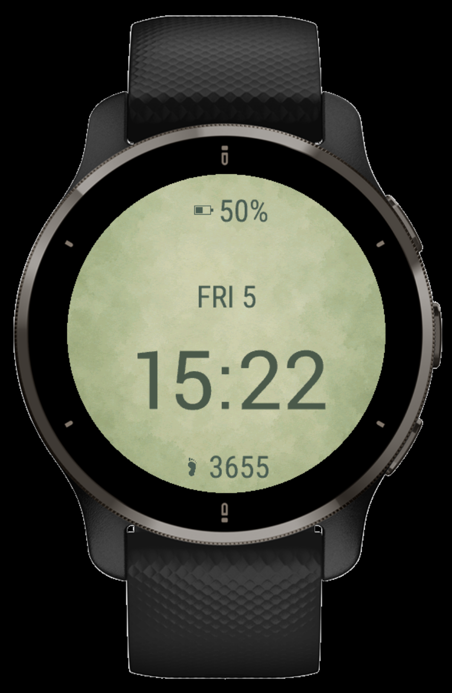
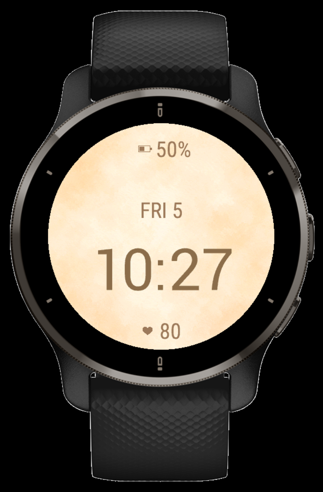
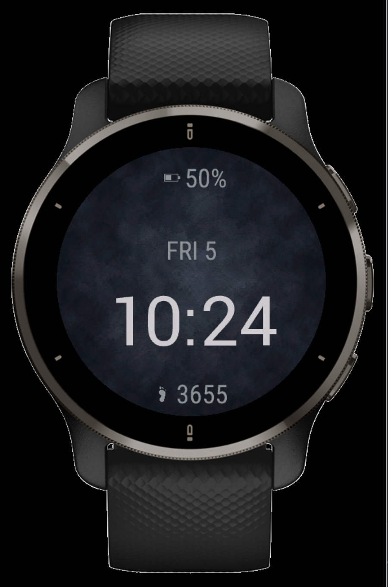

# Peacely

A calm Garmin watch face inspired by nature, mindfulness, and simplicity.

Peacely is designed to feel soft, readable, and peaceful on the wrist, combining watercolor-style backgrounds, minimal typography, and a clean wellness-focused layout.

## Features

* Large, easy-to-read time display
* Battery percentage indicator
* Daily step count
* Optional heart-rate metric
* 24-hour and 12-hour time format support
* Three calming visual themes
* Lightweight minimalist design
* Configurable settings through the Garmin Connect IQ app

## Themes

### Sage

A soft green theme inspired by nature and everyday calm.

### Warm

A warm paper-inspired theme with gentle contrast.

### Night

A dark theme designed for low-light environments and reduced visual distraction.

## Settings

Peacely includes the following configurable options:

* Theme: Sage, Warm, Night
* Bottom Metric: Steps or Heart Rate
* Time Format: 24-hour or 12-hour

## Device Support

Currently tested and supported on:

- Garmin Venu 2 Plus
- Garmin Venu 2
- Garmin Venu 2S

Support for additional Garmin devices may be added in future updates.

## Screenshots

| Sage | Warm | Night |
|------|------|------|
|  |  |  |

## Technology

* Monkey C
* Garmin Connect IQ SDK
* Garmin Venu 2 Series
* Visual Studio Code

## Status

✅ Beta tested on a real Garmin Venu 2 Plus

### Verified Functionality

* Theme switching
* Steps metric
* Heart-rate metric
* 24-hour and 12-hour time formats
* Garmin Connect IQ settings integration
* Real-device installation and synchronization

## Roadmap

- Additional Garmin device support after testing and asset optimization
- Optional visual refinements based on user feedback
- Connect IQ Store approval and public release
